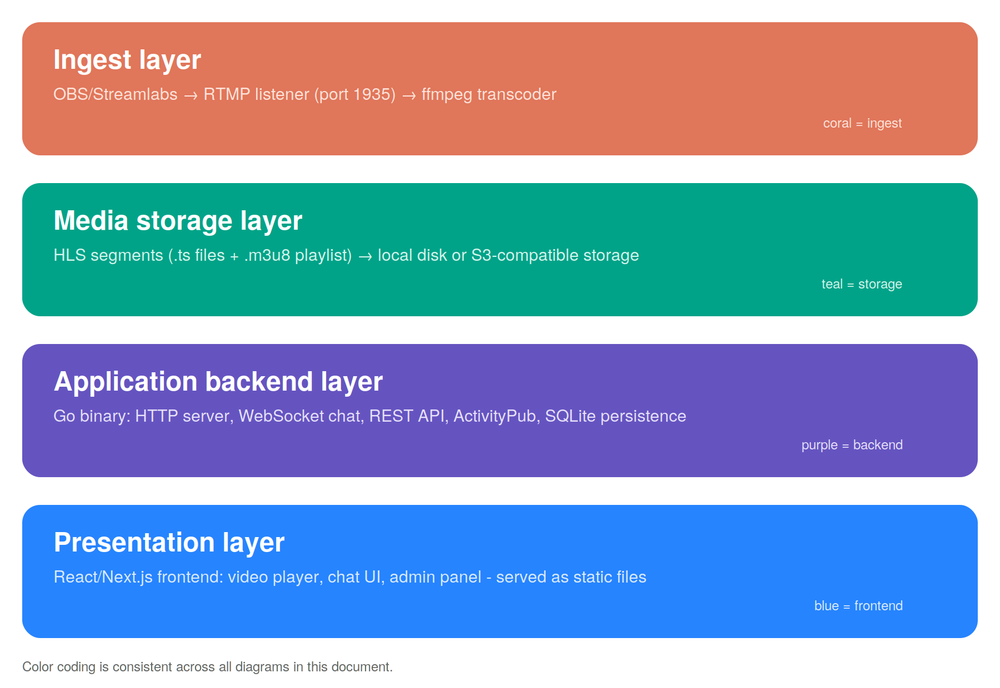
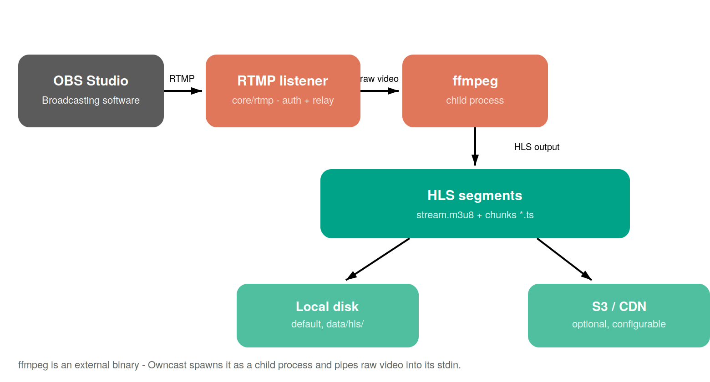
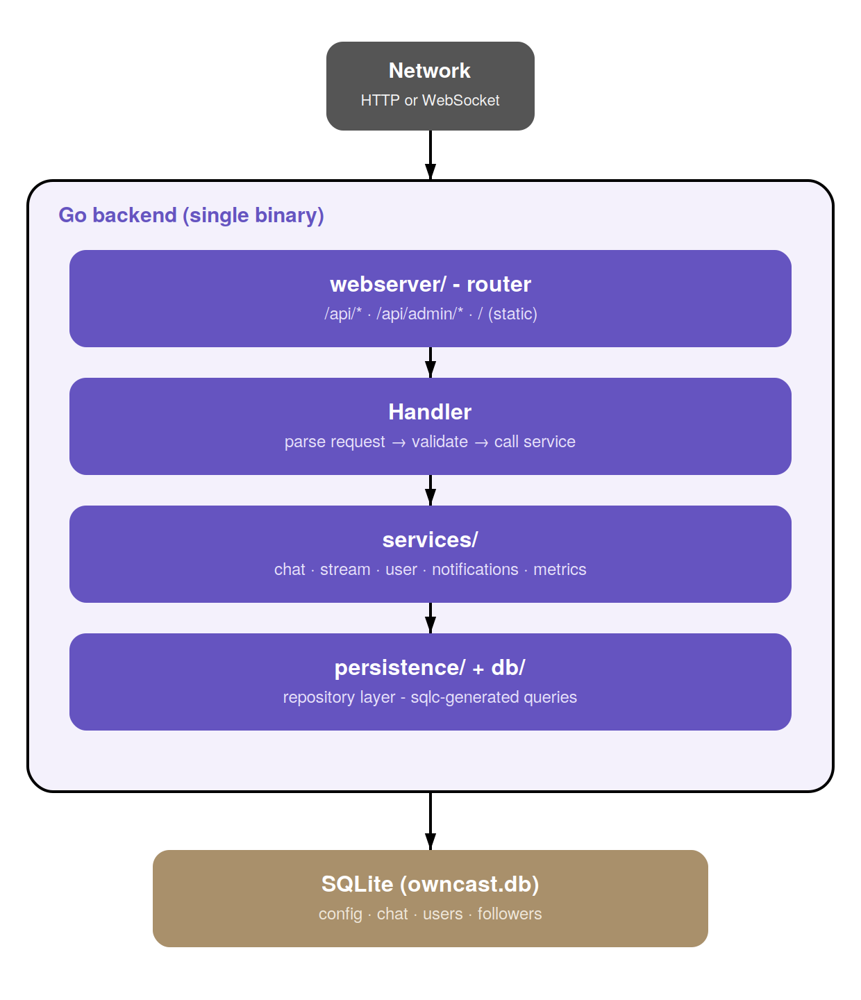
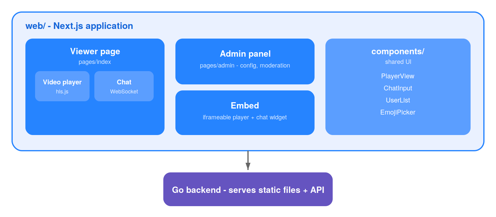
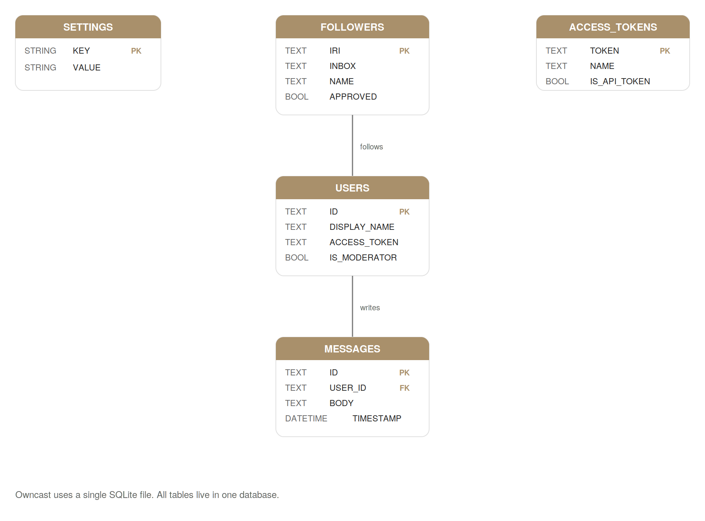
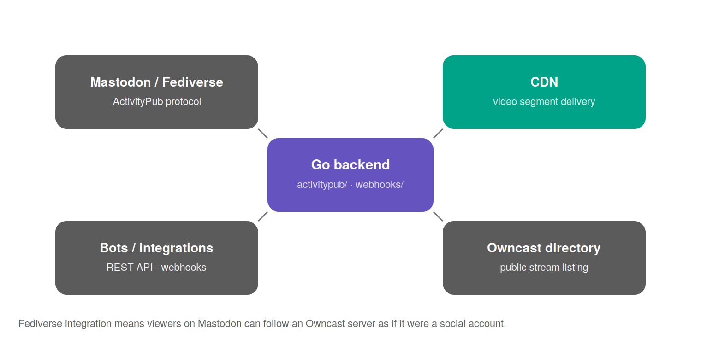

# Architecture Overview

Owncast is a single-binary application: one process handles video ingest,
transcoding coordination, chat, API, and serving the frontend. This document
explains how the system is structured, how data moves through it, and where
each piece lives in the codebase.

> Color coding is consistent across all diagrams in this document: coral =
> ingest, teal = storage, purple = backend, blue = frontend/clients.
>
{style="note"}

## 1. System layers

At a high level, Owncast receives an RTMP stream, transcodes it into HLS,
serves the frontend, and emits webhook events as activity occurs.

The system has four distinct layers. Each has a single responsibility and a
clear boundary.

## 2. Stream ingest: from OBS to storage

When a broadcaster clicks "Start Streaming" in OBS, a chain of three steps
runs before any viewer can watch. This is the ingest pipeline.

> ffmpeg is an external binary, not Go code. Owncast spawns it as a child
> process and pipes raw video data into its stdin. This is intentional:
> ffmpeg handles all codec complexity so Owncast doesn't have to.
>
{style="tip"}

## 3. Backend internals: request path

All HTTP traffic - REST API, WebSocket chat, admin panel, static frontend -
enters through a single Go HTTP server. Here is how a request travels from
the network to the database and back.

Each layer only talks to the layer directly below it. A handler never
queries the database directly - it always goes through a service. A service
never writes SQL directly - it always goes through persistence. This
separation makes each layer testable in isolation.

**What lives in `services/`:**

| Service | Responsibility |
|---|---|
| `chat` | WebSocket broadcast, ban management |
| `stream` | Live/offline state |
| `user` | Auth, tokens, roles |
| `notifications` | Discord, browser push |
| `activitypub` | Fediverse protocol (follow, federate) |
| `metrics` | Viewers, performance |
| `webhooks` | Outbound third-party event delivery |

## 4. Frontend: React application

The frontend is a Next.js application that lives in the `web/` directory. It
is built separately from the Go backend and compiled into static files. At
runtime the Go backend serves these files - no Node.js process runs in
production.

The video player uses `hls.js` - a JavaScript library that fetches HLS
segments directly from disk or S3. The Go backend is not in the video
playback path once streaming starts. Chat, however, always goes through the
Go WebSocket server.

## 5. Database schema (key tables)

Owncast uses a single SQLite file. All tables live in one database. There is
no migrations framework - schema changes are handled in Go code at startup.

## 6. External connections

Owncast connects to three types of external systems beyond the browser.

- **Mastodon / Fediverse** - via the ActivityPub protocol (`activitypub/`).
  Viewers on Mastodon can follow an Owncast server as if it were a social
  media account; when a stream goes live, a post appears in their timeline.
- **Bots / integrations** - via the REST API and webhooks (`webhooks/`).
- **CDN** - for video segment delivery when S3-compatible storage is
  configured.
- **Owncast directory** - the public stream listing that self-hosted servers
  can optionally publish to.
## See also

- [Webhooks API Reference](Webhooks-Api-Reference.md) - how the `webhooks/` service publishes outbound events
- [Viewer Metrics](Viewer-Metrics.md) - fields carried inside the STREAM_TITLE_UPDATED webhook payload
- [Owncast Documentation](Owncast-Documentation.md) - back to overview
---

*Based on Owncast v0.2.4 · [github.com/owncast/owncast](https://github.com/owncast/owncast)*

---